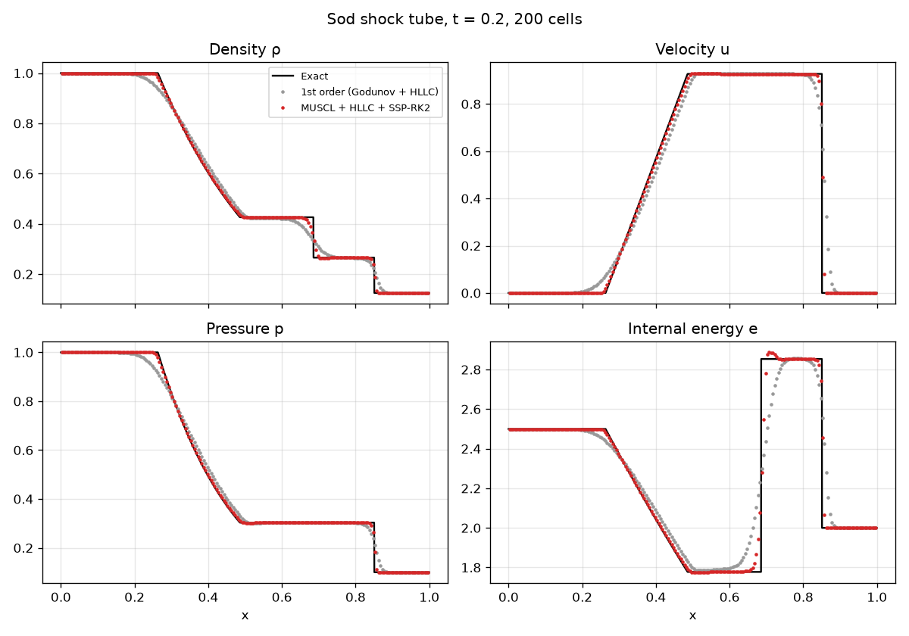
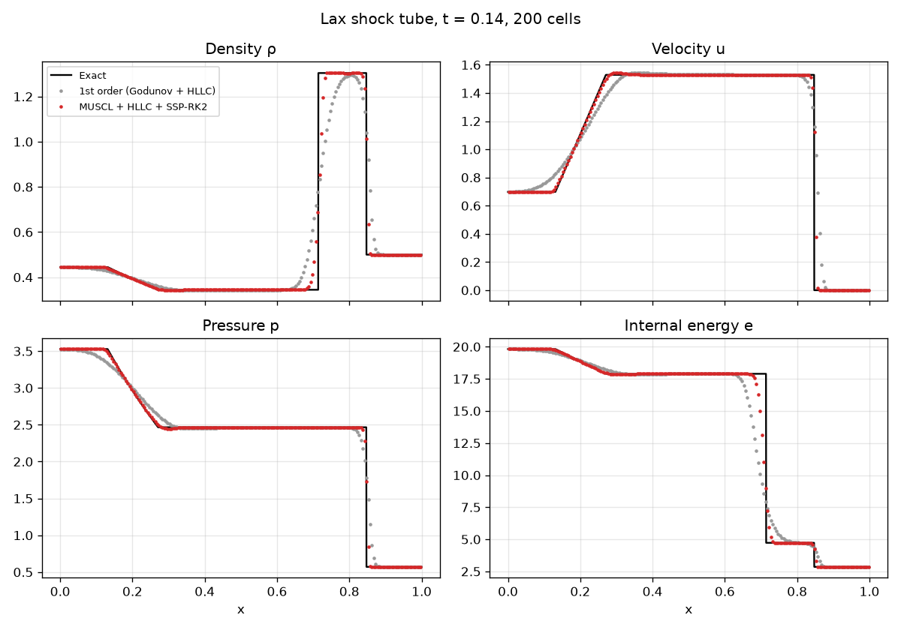
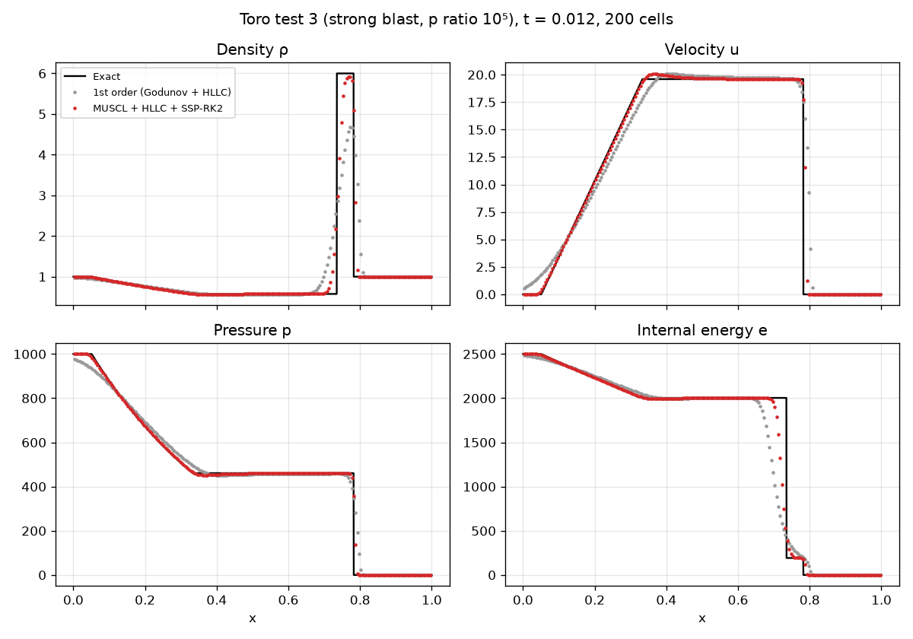
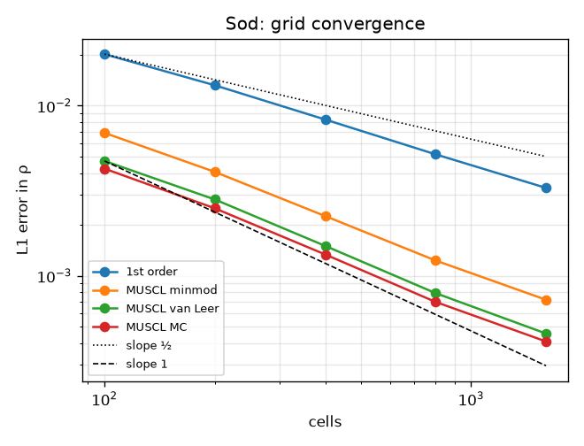

# Shock Tube: 1D Compressible Euler Solver

[](https://github.com/cfdgasman/sod-shock-tube/actions/workflows/ci.yml)

A compact finite-volume solver for the 1D compressible Euler equations, with an **exact Riemann solver** to validate it against. It is tested on the Sod and Lax shock tubes and on Toro's strong-blast problem, which has a 10⁵ pressure jump.

<p align="center"></p>

## Method

| | |
|---|---|
| Equations | 1D Euler, ideal gas, γ = 1.4 |
| Riemann solver | **HLLC** (Toro, Ch. 10) with Davis wave-speed estimates |
| Reconstruction | 1st order (Godunov), or **MUSCL** on primitive variables with minmod / van Leer / MC limiters |
| Time integration | SSP-RK2 (Heun), CFL = 0.5 |
| Boundaries | Transmissive, two ghost cells |
| Reference solution | **Exact Riemann solver**: Newton iteration for p* from a PVRS initial guess, then self-similar sampling (Toro, Ch. 4) |

## Results

### Exact star states

| Test | p* | u* | Toro (2009) |
|---|---|---|---|
| Sod | 0.303130 | 0.927453 | 0.30313, 0.92745 ✓ |
| Toro test 3 | 460.894 | 19.5975 | 460.894, 19.5975 ✓ |

### Lax shock tube and strong blast (200 cells)

<p align="center">


</p>

MUSCL + HLLC stays stable and positive through the 10⁵ pressure ratio of Toro test 3. It captures the shock in 2–3 cells, while the first-order scheme smears the contact discontinuity over about 15 cells.

### Grid convergence, Sod (L1 density error against exact cell averages)

<p align="center"></p>

| Cells | 1st order | MUSCL minmod | MUSCL van Leer | MUSCL MC |
|---|---|---|---|---|
| 100 | 2.01e-02 | 6.93e-03 | 4.73e-03 | 4.27e-03 |
| 200 | 1.32e-02 | 4.08e-03 | 2.81e-03 | 2.49e-03 |
| 400 | 8.30e-03 | 2.24e-03 | 1.50e-03 | 1.33e-03 |
| 800 | 5.18e-03 | 1.23e-03 | 7.90e-04 | 7.02e-04 |
| 1600 | 3.29e-03 | 7.23e-04 | 4.57e-04 | 4.11e-04 |
| **observed order** | **0.66** | **0.83** | **0.86** | **0.86** |

This is the expected behaviour for a solution with discontinuities. Shocks converge at first order in L1. A linearly degenerate contact smears as t^{1/(m+1)} for a scheme of order m, which gives L1 rates of 1/2 (1st order) and 2/3 (2nd order). The observed rates fall between those limits. At a fixed resolution, the second-order schemes are **4–7× more accurate** than first order, and the compressive MC limiter is the most accurate.

## Usage

```bash
pip install -r requirements.txt
python run.py      # all test cases, convergence table, figures in docs/ (~10 s)
pytest             # star states, flux consistency, conservation, error bounds
```

```python
from euler1d import State, sample, solve
rho, u, p = sample(x, t, State(1, 0, 1), State(0.125, 0, 0.1))   # exact
x, rho, u, p = solve(rho0, u0, p0, t_end=0.2, limiter="mc")      # numerical
```

## Reference

E. F. Toro, *Riemann Solvers and Numerical Methods for Fluid Dynamics*, 3rd ed., Springer, 2009.

## License

MIT
